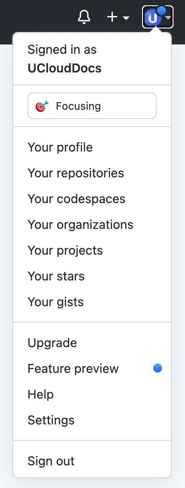
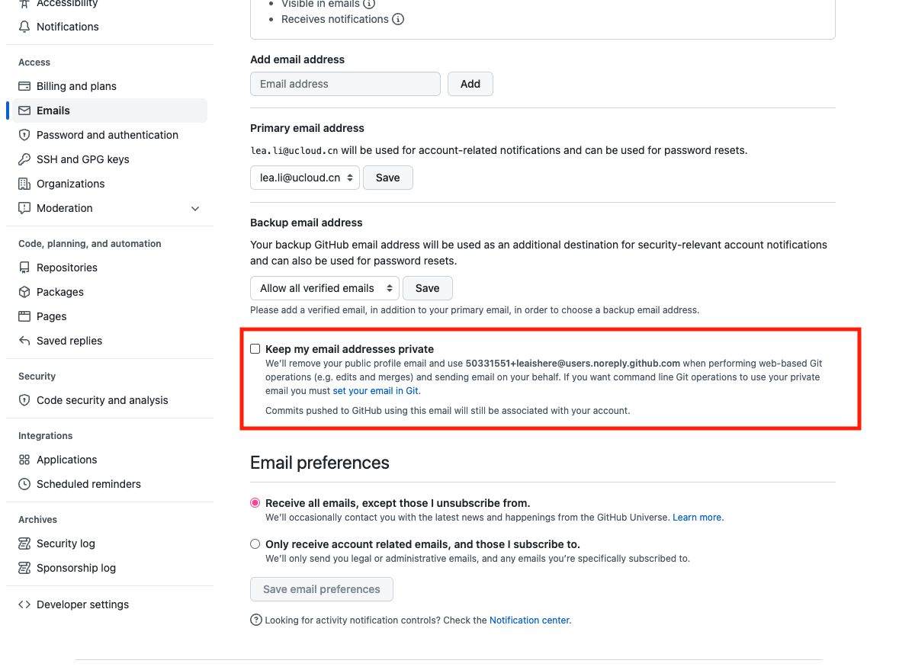
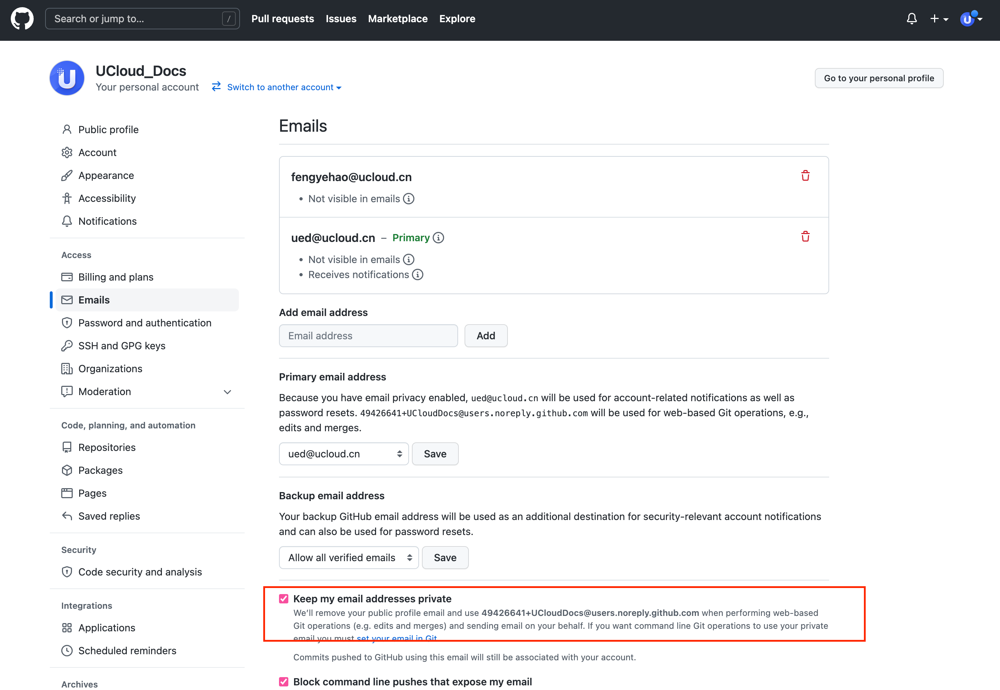

# 如何激活发布权限？

1. 确保您github账号下Primary Email是ucloud的邮箱
2. 登入github并找到Setting
    
3. 前往Email配置并**取消**“Keep Private”的勾选
    
    
3. 前往Email配置并【取消】“Keep Private”的勾选
    
4. **在仓库中任意一篇文章进行修改并Commit**
5. 恭喜获得发布权限！前往[发布页面](https://cms-docs.ucloudadmin.com/ucpublishnew.html)
