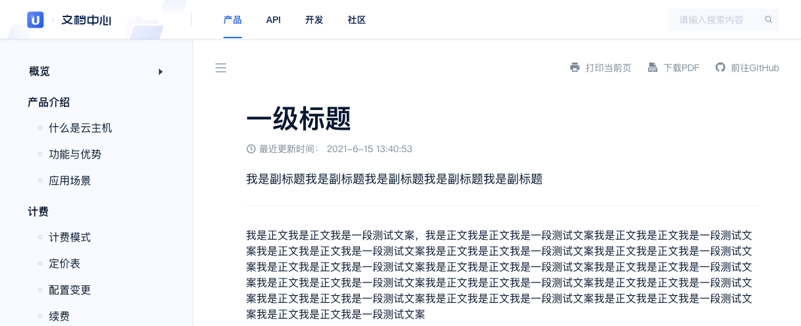

# 如何添加副标题

为了方便用户快速理解每篇文档的主要内容。平台支持编者使用`<subtitle>我是副标题</subtitle>`来定义副标题。

```markdown
# 一级标题
<subtitle>我是副标题我是副标题我是副标题我是副标题我是副标题</subtitle>

我是正文我是正文我是一段测试文案，我是正文我是正文我是一段测试文案我是正文我是正文我是一段测试文案我是正文我是正文我是一段测试文案我是正文我是正文我是一段测试文案我是正文我是正文我是一段测试文案我是正文我是正文我是一段测试文案我是正文我是正文我是一段测试文案我是正文我是正文我是一段测试文案我是正文我是正文我是一段测试文案我是正文我是正文我是一段测试文案我是正文我是正文我是一段测试文案我是正文我是正文我是一段测试文案我是正文我是正文我是一段测试文案我是正文我是正文我是一段测试文案我是正文我是正文我是一段测试文案
```


添加后效果如下



