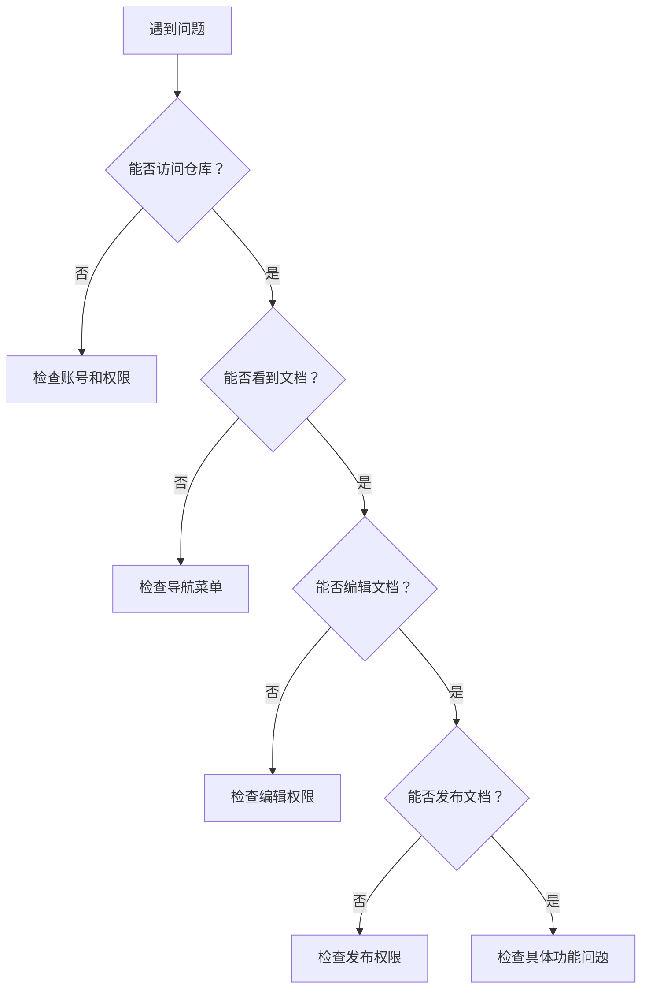

# 常见问题解答

> 🆘 **目标**：快速解决使用过程中的常见问题

## 📋 问题分类导航

### 🚀 [快速定位问题](#快速定位问题)
- [账号和权限问题](#账号和权限问题)
- [文档创建问题](#文档创建问题)
- [发布和预览问题](#发布和预览问题)
- [格式和样式问题](#格式和样式问题)
- [图片和媒体问题](#图片和媒体问题)
- [导航和菜单问题](#导航和菜单问题)
- [本地编辑问题](#本地编辑问题)
- [权限和安全问题](#权限和安全问题)

## 🔍 快速定位问题

### 问题诊断流程



### 🎯 问题快速匹配

| 症状描述 | 可能原因 | 快速跳转 |
|----------|----------|----------|
| 收不到邀请邮件 | 邮箱设置问题 | [邮箱问题](#q-收不到github邀请邮件怎么办) |
| 左侧菜单不显示 | sidebar文件问题 | [菜单问题](#q-左侧目录无法显示文档入口) |
| 无法发布文档 | 发布权限未激活 | [发布问题](#q-如何激活发布权限) |
| 图片无法显示 | 图片路径错误 | [图片问题](#q-图片无法正常显示) |
| 格式显示异常 | Markdown语法错误 | [格式问题](#q-文档格式显示不正确) |
| 本地同步失败 | Git配置问题 | [同步问题](#q-本地修改无法同步到线上) |

## 👤 账号和权限问题

### Q: 收不到GitHub邀请邮件怎么办？

**A: 邮箱设置解决方案**

#### 检查邮箱设置

1. **登录GitHub账号**
   - 访问 [GitHub设置页面](https://github.com/settings/emails)
   - 检查邮箱地址是否正确
   - 确认邮箱已验证（显示绿色✓）

2. **检查邮件过滤**
   - 查看垃圾邮件文件夹
   - 检查邮件过滤规则
   - 将 `noreply@github.com` 添加到白名单

3. **重新发送邀请**
   - 联系仓库管理员重新发送邀请
   - 确认使用正确的邮箱地址

#### 邮箱配置步骤

**Step 1: 访问邮箱设置**
```
1. 登录GitHub
2. 点击右上角头像
3. 选择 "Settings"
4. 点击左侧 "Emails"
```

**Step 2: 验证邮箱**
```
1. 如果邮箱未验证，点击 "Resend verification email"
2. 检查邮箱收到的验证邮件
3. 点击邮件中的验证链接
4. 确认邮箱状态变为已验证
```

**Step 3: 配置通知设置**
```
1. 访问 "Settings" > "Notifications"
2. 确保 "Email" 选项已启用
3. 检查 "Repository invitations" 是否启用
```

> 💡 **提示**：如果仍然收不到邮件，可以尝试使用其他邮箱地址

### Q: 如何申请仓库访问权限？

**A: 权限申请流程**

#### 申请步骤

1. **准备申请信息**
   - GitHub用户名
   - 注册邮箱地址
   - 申请理由说明
   - 需要的权限级别

2. **提交申请**
   - 联系项目负责人或管理员
   - 填写权限申请表（如有）
   - 提供必要的身份验证

3. **等待审核**
   - 管理员审核申请
   - 可能需要额外的验证
   - 审核通过后发送邀请

4. **接受邀请**
   - 检查邮箱收到的邀请邮件
   - 点击邮件中的接受链接
   - 确认权限生效

### Q: 权限不足无法编辑文档？

**A: 权限检查和解决**

#### 检查当前权限

1. **访问仓库页面**
   - 查看是否能看到 "Edit" 按钮
   - 检查是否能创建新文件
   - 确认是否能提交更改

2. **确认权限级别**
   - **Read**：只能查看，无法编辑
   - **Write**：可以编辑和提交
   - **Admin**：完全管理权限

#### 解决方案

```markdown
1. 联系仓库管理员申请更高权限
2. 确认是否在正确的分支上操作
3. 检查是否有分支保护规则
4. 尝试通过Pull Request提交更改
```

## 📝 文档创建问题

### Q: 如何创建新的文档文件？

**A: 文档创建步骤**

#### 在GitHub网页端创建

**Step 1: 进入目标目录**
```
1. 访问仓库主页
2. 导航到要创建文档的目录
3. 点击 "Add file" > "Create new file"
```

**Step 2: 命名文件**
```
1. 输入文件名（必须以.md结尾）
2. 如需创建子目录，使用 "folder/filename.md" 格式
3. 确保文件名符合命名规范
```

**Step 3: 编写内容**
```
1. 在编辑器中输入Markdown内容
2. 使用预览功能检查格式
3. 添加必要的元数据和标题
```

**Step 4: 提交文件**
```
1. 滚动到页面底部
2. 填写提交信息
3. 选择提交到主分支或创建新分支
4. 点击 "Commit new file"
```

#### 文件命名规范

```markdown
✅ 正确示例：
- quick-start.md
- user-guide.md
- api-reference.md
- getting-started/installation.md

❌ 错误示例：
- Quick Start.md（包含空格）
- 用户指南.md（中文文件名）
- guide.txt（错误扩展名）
- Guide.MD（大写扩展名）
```

### Q: 如何组织文档结构？

**A: 文档结构最佳实践**

#### 推荐目录结构

```
docs/
├── README.md                 # 项目首页
├── _sidebar.md              # 导航菜单
├── overview.md              # 产品概览
├── getting-started/         # 入门指南
│   ├── quick-start.md
│   ├── installation.md
│   └── basic-config.md
├── user-guide/              # 用户指南
│   ├── features.md
│   ├── operations.md
│   └── best-practices.md
├── advanced/                # 高级功能
│   ├── advanced-config.md
│   ├── api-reference.md
│   └── development.md
├── faq/                     # 常见问题
│   ├── common-issues.md
│   └── troubleshooting.md
├── images/                  # 图片资源
│   ├── screenshots/
│   ├── diagrams/
│   └── icons/
└── changelog.md             # 更新日志
```

#### 结构设计原则

1. **逻辑清晰**：按功能和用户需求分类
2. **层次合理**：避免过深的目录嵌套
3. **命名统一**：使用一致的命名规范
4. **易于维护**：便于后续更新和扩展

## 🚀 发布和预览问题

### Q: 如何激活发布权限？

**A: 发布权限激活步骤**

#### 激活流程

**Step 1: 配置邮箱**
```
1. 登录GitHub账号
2. 进入 Settings > Emails
3. 确保邮箱已验证
4. 设置为主邮箱（Primary）
```

**Step 2: 进行首次提交**
```
1. 在仓库中创建或编辑任意文件
2. 填写提交信息
3. 点击 "Commit changes"
4. 等待系统处理
```

**Step 3: 检查权限状态**
```
1. 访问仓库的 Settings 页面
2. 查看 Pages 设置
3. 确认发布源已配置
4. 检查发布状态
```

**Step 4: 验证发布**
```
1. 等待几分钟让系统处理
2. 访问发布的URL
3. 确认页面正常显示
4. 测试导航和链接
```

> ⚠️ **注意**：首次激活可能需要等待5-10分钟

### Q: 文档更新后没有立即生效？

**A: 发布延迟解决方案**

#### 常见原因和解决方法

1. **缓存问题**
   ```
   - 强制刷新浏览器（Ctrl+F5 或 Cmd+Shift+R）
   - 清除浏览器缓存
   - 尝试无痕模式访问
   ```

2. **构建延迟**
   ```
   - 检查仓库的 Actions 页面
   - 查看构建状态和日志
   - 等待构建完成（通常1-5分钟）
   ```

3. **配置错误**
   ```
   - 检查 _sidebar.md 文件语法
   - 验证文件路径是否正确
   - 确认Markdown语法无误
   ```

#### 发布状态检查

**检查构建状态**
```
1. 访问仓库主页
2. 点击 "Actions" 标签
3. 查看最新的工作流运行状态
4. 如有错误，点击查看详细日志
```

**检查Pages设置**
```
1. 进入仓库 Settings
2. 滚动到 "Pages" 部分
3. 确认源分支设置正确
4. 检查自定义域名配置（如有）
```

### Q: 如何预览文档效果？

**A: 预览方法汇总**

#### 在线预览

1. **GitHub预览**
   - 在文件页面点击 "Preview" 标签
   - 查看基本的Markdown渲染效果
   - 注意：不包含自定义样式

2. **发布预览**
   - 访问GitHub Pages的URL
   - 查看完整的发布效果
   - 包含所有样式和功能

#### 本地预览

1. **使用Typora**
   ```
   - 下载并安装Typora
   - 打开本地Markdown文件
   - 实时预览编辑效果
   ```

2. **使用docsify本地服务**
   ```bash
   # 安装docsify-cli
   npm install -g docsify-cli
   
   # 在文档目录运行
   docsify serve docs
   
   # 访问 http://localhost:3000
   ```

## 🎨 格式和样式问题

### Q: 文档格式显示不正确？

**A: 格式问题诊断和修复**

#### 常见格式问题

1. **标题格式错误**
   ```markdown
   ❌ 错误：
   #标题（缺少空格）
   # 标题 #（多余的#）
   
   ✅ 正确：
   # 标题
   ## 二级标题
   ### 三级标题
   ```

2. **列表格式错误**
   ```markdown
   ❌ 错误：
   -项目1（缺少空格）
   - 项目2
   -项目3（不一致）
   
   ✅ 正确：
   - 项目1
   - 项目2
   - 项目3
   ```

3. **链接格式错误**
   ```markdown
   ❌ 错误：
   [链接文字] (url)（空格位置错误）
   [链接文字](url "标题")（引号类型错误）
   
   ✅ 正确：
   [链接文字](url)
   [链接文字](url "标题")
   ```

4. **代码块格式错误**
   ```markdown
   ❌ 错误：
   ```代码
   console.log('hello');
   ```
   
   ✅ 正确：
   ```javascript
   console.log('hello');
   ```
   ```

#### 格式检查工具

**在线检查**
- [Markdown Lint](https://dlaa.me/markdownlint/)
- [Markdown Editor](https://markdown-editor.github.io/)

**编辑器插件**
- VS Code: Markdown All in One
- Typora: 实时预览
- Atom: Markdown Preview Plus

### Q: 表格显示异常？

**A: 表格格式修复**

#### 正确的表格语法

```markdown
| 列1 | 列2 | 列3 |
|-----|-----|-----|
| 内容1 | 内容2 | 内容3 |
| 内容4 | 内容5 | 内容6 |
```

#### 表格对齐

```markdown
| 左对齐 | 居中对齐 | 右对齐 |
|:-------|:--------:|-------:|
| 内容 | 内容 | 内容 |
```

#### 常见表格问题

1. **分隔符不一致**
   ```markdown
   ❌ 错误：
   | 列1 | 列2 |
   |-----|----|
   | 内容1 | 内容2
   
   ✅ 正确：
   | 列1 | 列2 |
   |-----|-----|
   | 内容1 | 内容2 |
   ```

2. **缺少分隔行**
   ```markdown
   ❌ 错误：
   | 列1 | 列2 |
   | 内容1 | 内容2 |
   
   ✅ 正确：
   | 列1 | 列2 |
   |-----|-----|
   | 内容1 | 内容2 |
   ```

## 🖼️ 图片和媒体问题

### Q: 图片无法正常显示？

**A: 图片问题解决方案**

#### 检查图片路径

1. **相对路径规则**
   ```markdown
   # 当前目录下的图片
   
   
   # images文件夹中的图片
   
   
   # 上级目录的图片
   
   ```

2. **路径检查清单**
   ```markdown
   □ 文件路径是否正确
   □ 文件名大小写是否匹配
   □ 文件扩展名是否正确
   □ 是否使用了中文路径
   □ 是否包含特殊字符
   ```

#### 图片格式要求

**支持的格式**
- ✅ PNG（推荐用于截图）
- ✅ JPG/JPEG（推荐用于照片）
- ✅ GIF（支持动图）
- ✅ SVG（矢量图形）
- ❌ BMP（不推荐）
- ❌ TIFF（不支持）

**文件大小限制**
- 单个图片：< 10MB
- 推荐大小：< 2MB
- GIF动图：< 5MB

#### 图片优化建议

1. **压缩图片**
   - 使用TinyPNG等在线工具
   - 调整图片分辨率
   - 选择合适的质量设置

2. **规范命名**
   ```
   ✅ 推荐命名：
   - login-page-screenshot.png
   - user-dashboard-overview.jpg
   - workflow-diagram.svg
   
   ❌ 避免命名：
   - 屏幕截图.png
   - IMG_001.jpg
   - 图片 (1).png
   ```

### Q: 如何添加图片说明和样式？

**A: 图片增强技巧**

#### 基础图片语法

```markdown
# 基本图片


# 带链接的图片
[](https://example.com)

# 指定图片大小（HTML语法）

```

#### 图片居中和样式

```html
<!-- 居中显示 -->
<div align="center">
  
</div>

<!-- 带边框的图片 -->


<!-- 响应式图片 -->

```

#### 图片说明文字

```markdown

*图1：系统配置界面，显示了主要的配置选项*

---

<div align="center">
  
  <br>
  <em>图2：系统整体架构图</em>
</div>
```

## 🧭 导航和菜单问题

### Q: 左侧目录无法显示文档入口？

**A: 导航菜单问题解决**

#### 检查_sidebar.md文件

1. **文件位置检查**
   ```
   ✅ 正确位置：
   docs/_sidebar.md
   
   ❌ 错误位置：
   docs/sidebar.md
   docs/_Sidebar.md
   _sidebar.md（根目录）
   ```

2. **文件内容检查**
   ```markdown
   ✅ 正确格式：
   * [首页](README.md)
   * [快速开始](getting-started.md)
     * [安装指南](installation.md)
     * [配置说明](configuration.md)
   
   ❌ 错误格式：
   - [首页](README.md)  # 使用了-而不是*
   *[快速开始](getting-started.md)  # 缺少空格
   * [安装指南] (installation.md)  # 空格位置错误
   ```

3. **路径检查**
   ```markdown
   ✅ 正确路径：
   * [文档](docs/guide.md)
   * [API](api/reference.md)
   
   ❌ 错误路径：
   * [文档](/docs/guide.md)  # 绝对路径
   * [文档](./docs/guide.md)  # 不必要的./
   * [文档](docs\guide.md)  # 错误的路径分隔符
   ```

#### 常见sidebar问题

**问题1：菜单不显示**
```markdown
原因：_sidebar.md文件不存在或位置错误
解决：在docs目录下创建_sidebar.md文件
```

**问题2：链接无法点击**
```markdown
原因：文件路径错误或文件不存在
解决：检查路径和文件是否存在
```

**问题3：层级显示错误**
```markdown
原因：缩进不正确或使用了错误的符号
解决：使用空格缩进，统一使用*符号
```

#### sidebar.md模板

```markdown
<!-- _sidebar.md -->

* [产品概览](overview.md)

* Getting started
  * [快速上手](getting-started/quick-start.md)
  * [基础配置](getting-started/basic-config.md)
  * [常见问题](getting-started/faq.md)

* User Guidebook
  * [功能介绍](user-guide/features.md)
  * [操作指南](user-guide/operations.md)
  * [最佳实践](user-guide/best-practices.md)

* FAQ
  * [常见问题](faq/common-issues.md)
  * [故障排除](faq/troubleshooting.md)

* [更新日志](changelog.md)
```

### Q: 如何创建多级菜单？

**A: 多级菜单配置**

#### 菜单层级规则

```markdown
* 一级菜单
  * 二级菜单
    * 三级菜单
      * 四级菜单（不推荐超过3级）
```

#### 实际示例

```markdown
* [产品介绍](overview.md)

* 用户指南
  * 基础功能
    * [用户管理](user-guide/basic/user-management.md)
    * [权限设置](user-guide/basic/permissions.md)
  * 高级功能
    * [API集成](user-guide/advanced/api-integration.md)
    * [自定义配置](user-guide/advanced/custom-config.md)

* 开发者文档
  * API参考
    * [认证接口](api/auth.md)
    * [用户接口](api/users.md)
  * SDK文档
    * [JavaScript SDK](sdk/javascript.md)
    * [Python SDK](sdk/python.md)
```

#### 菜单设计最佳实践

1. **层级控制**：建议不超过3级
2. **命名清晰**：使用简洁明了的名称
3. **逻辑分组**：按功能或用户类型分组
4. **顺序合理**：按使用频率或重要性排序

## 💻 本地编辑问题

### Q: 本地修改无法同步到线上？

**A: Git同步问题解决**

#### 检查Git状态

```bash
# 检查当前状态
git status

# 检查远程仓库
git remote -v

# 检查分支
git branch -a
```

#### 常见同步问题

1. **未提交本地更改**
   ```bash
   # 添加所有更改
   git add .
   
   # 提交更改
   git commit -m "更新文档"
   
   # 推送到远程
   git push origin main
   ```

2. **分支不匹配**
   ```bash
   # 检查当前分支
   git branch
   
   # 切换到主分支
   git checkout main
   
   # 推送到正确分支
   git push origin main
   ```

3. **远程仓库冲突**
   ```bash
   # 拉取远程更新
   git pull origin main
   
   # 解决冲突后重新提交
   git add .
   git commit -m "解决冲突"
   git push origin main
   ```

#### GitHub Desktop问题

**同步失败**
```
1. 检查网络连接
2. 重新登录GitHub账号
3. 检查仓库权限
4. 尝试手动同步
```

**提交失败**
```
1. 确保有提交信息
2. 检查文件是否已添加
3. 确认有写入权限
4. 检查分支保护规则
```

### Q: Typora编辑器配置问题？

**A: Typora优化配置**

#### 基础设置

1. **文件树设置**
   ```
   菜单：视图 > 文件树
   快捷键：Ctrl+Shift+L (Windows) / Cmd+Shift+L (Mac)
   ```

2. **图片设置**
   ```
   菜单：文件 > 偏好设置 > 图像
   设置：复制图片到 ./images 文件夹
   ```

3. **主题设置**
   ```
   菜单：主题
   推荐：GitHub主题（接近最终显示效果）
   ```

#### 高级配置

**自动保存**
```
偏好设置 > 编辑器 > 自动保存
勾选：自动保存
```

**实时预览**
```
偏好设置 > 编辑器 > 实时预览
勾选：实时预览
```

**代码高亮**
```
偏好设置 > Markdown > 代码块
启用：语法高亮
```

## 🔒 权限和安全问题

### Q: 如何处理权限被误用的情况？

**A: 权限安全处理**

#### 发现权限误用

1. **立即报告**
   - 联系仓库管理员
   - 详细描述发现的问题
   - 提供相关证据截图

2. **紧急处理**
   - 管理员评估风险级别
   - 必要时临时冻结权限
   - 防止进一步损失

3. **调查分析**
   - 查看操作日志
   - 分析影响范围
   - 确定责任归属

#### 预防措施

```markdown
1. 定期审查权限设置
2. 建立操作审核机制
3. 加强安全意识培训
4. 使用最小权限原则
```

### Q: 如何安全地更换GitHub账号？

**A: 账号更换安全流程**

#### 更换前准备

1. **数据备份**
   ```
   - 导出个人贡献记录
   - 备份重要文档
   - 记录配置信息
   - 整理权限清单
   ```

2. **交接准备**
   ```
   - 整理负责的项目清单
   - 准备工作交接文档
   - 与接替人员沟通
   - 确保信息完整备份
   ```

#### 更换流程

**Step 1: 申请新权限**
```
1. 使用新账号申请权限
2. 提供身份验证材料
3. 说明账号更换原因
4. 等待管理员审核
```

**Step 2: 权限迁移**
```
1. 管理员为新账号配置权限
2. 测试新账号功能
3. 确认权限设置正确
4. 进行功能验证
```

**Step 3: 旧账号处理**
```
1. 撤销旧账号权限
2. 更新文档中的联系信息
3. 通知团队成员
4. 归档贡献记录
```

## 🛠️ 技术支持和帮助

### 📞 获取技术支持

#### 支持渠道

1. **文档自助**
   - 查阅本FAQ文档
   - 搜索相关问题解答
   - 查看操作指南

2. **社区支持**
   - GitHub Issues
   - 技术论坛
   - 用户群组

3. **官方支持**
   - 邮件支持：support@example.com
   - 在线客服：工作日 9:00-18:00
   - 电话支持：400-xxx-xxxx

#### 提交问题的最佳实践

**问题描述模板**
```markdown
**问题描述**：
简洁描述遇到的问题

**复现步骤**：
1. 第一步操作
2. 第二步操作
3. 第三步操作

**期望结果**：
描述期望看到的结果

**实际结果**：
描述实际看到的结果

**环境信息**：
- 操作系统：
- 浏览器：
- 账号权限：

**截图或日志**：
附上相关截图或错误日志
```

### 🔍 问题排查技巧

#### 系统性排查方法

1. **确认问题范围**
   - 是个人问题还是系统问题？
   - 是新问题还是历史问题？
   - 影响范围有多大？

2. **收集相关信息**
   - 错误信息和截图
   - 操作步骤记录
   - 环境和配置信息
   - 时间和频率

3. **尝试基础解决方案**
   - 刷新页面或重新登录
   - 检查网络连接
   - 清除浏览器缓存
   - 尝试其他浏览器

4. **查找相似问题**
   - 搜索FAQ文档
   - 查看GitHub Issues
   - 咨询同事或社区

#### 常用调试工具

**浏览器开发者工具**
```
打开方式：F12 或右键 > 检查元素
用途：
- 查看网络请求
- 检查控制台错误
- 分析页面结构
- 调试JavaScript
```

**GitHub状态页面**
```
URL: https://www.githubstatus.com/
用途：检查GitHub服务状态
```

**网络连接测试**
```bash
# 测试网络连接
ping github.com

# 测试DNS解析
nslookup github.com

# 测试HTTPS连接
curl -I https://github.com
```

---

## 📚 相关资源

### 🔗 官方文档链接

- [GitHub官方文档](https://docs.github.com/)
- [Markdown语法指南](https://guides.github.com/features/mastering-markdown/)
- [GitHub Pages文档](https://docs.github.com/en/pages)
- [docsify官方文档](https://docsify.js.org/)

### 🛠️ 推荐工具

- [Typora](https://typora.io/) - Markdown编辑器
- [GitHub Desktop](https://desktop.github.com/) - Git客户端
- [Snipaste](https://www.snipaste.com/) - 截图工具
- [TinyPNG](https://tinypng.com/) - 图片压缩

### 📖 学习资源

- [Git教程](https://www.liaoxuefeng.com/wiki/896043488029600)
- [Markdown教程](https://markdown.com.cn/)
- [GitHub使用指南](https://guides.github.com/)
- [技术写作指南](https://developers.google.com/tech-writing)

---

💡 **提示**：如果本FAQ没有解决您的问题，请通过 [技术支持](../support/contact.md) 联系我们。